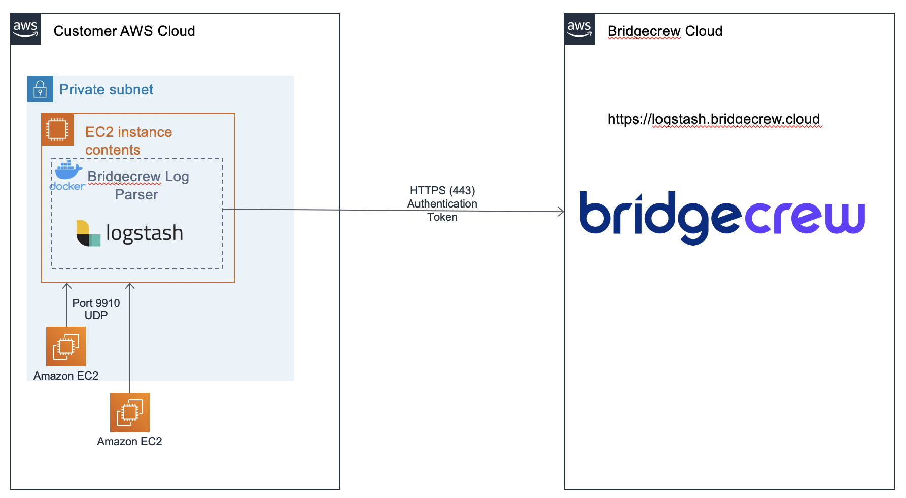

# Linux Authentication Log Integration
[](https://hub.docker.com/r/bridgecrew/linux-auth-integration)

This docker contains a Logstash agent that enables secure transport of log data back to Bridgecrew Console. It is set to collect data from Linux's auth.log file (using syslog) and send it to Bridgecrew in an encrypted and secure.

## Linux auth

The installation includes 2 steps:   
1. `auth.log` syslog configuration   
2. Installing the syslog integration docker 

## Architecture


### 1. Linux syslog configuration
1. Edit `sudo vi /etc/rsyslog.conf`
2. Add row: 
```sh 
auth,authpriv.* @[REPLACE_WITH_LOGSTASH_HOST]:9910
```

### 2. Install the syslog integration docker 
###### Port verification
Port 9910 (UDP) must be open between the to the logstash host (listening port).   
Verify that `iptables` is configured to allow incoming traffic on port 9910.

#### Installation

1. ssh into the server where logstash-docker should be deployed
2. Install docker
3. Verify docker install by running the following command: ``` docker info ```
4. Run syslog-integration docker by executing:
```sh
docker run -d -p 9910:9910/udp -e BC_CUSTOMER_NAME=[REPLACE_WITH_CUSTOMER_NAME] -e BC_API_TOKEN=[REPLACE_WITH_API_TOKEN] -e BC_URL="https://logstash.bridgecrew.cloud/logstash" bridgecrew/linux-auth-integration
```
