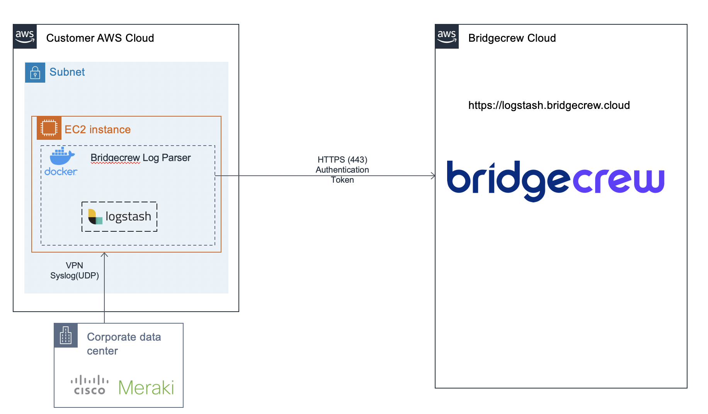

# Cisco Meraki Firewall Integration
[](https://hub.docker.com/r/bridgecrew/meraki-integration)

## Architecture 


## Integration Steps
1. Configure Meraki Logging
2. Deploy Meraki Integration using docker


### 1. Configure Meraki Logging

1. Make sure you have syslog-ng installed to receive log files.

2. Copy [syslog-ng/conf.d/meraki.conf](https://github.com/cs3gallery/meraki_logstash/tree/master/syslog-ng/conf.d) to /etc/syslog-ng/conf.d/ (Or follow Meraki Official docs [here](https://documentation.meraki.com/zGeneral_Administration/Monitoring_and_Reporting/Syslog_Server_Overview_and_Configuration))


### 2. Configure meraki integration
1. SSH to the meraki server
2. Install docker
```sh 
docker pull bridgecrew/meraki-integration:latest 
```

3. Verify docker by running the following command: ``` docker info ```
4. Run docker:
```sh
docker run -d  -v /var/log:/var/log -e BC_CUSTOMER_NAME=[REPLACE_WITH_CUSTOMER_NAME] -e BC_API_TOKEN=[REPLACE_WITH_API_TOKEN] -e BC_URL="https://logstash.bridgecrew.cloud/logstash" bridgecrew/meraki-integration
```


#### Licenses: 
GNU-2: https://github.com/cs3gallery/meraki_logstash/blob/master/LICENSE 
