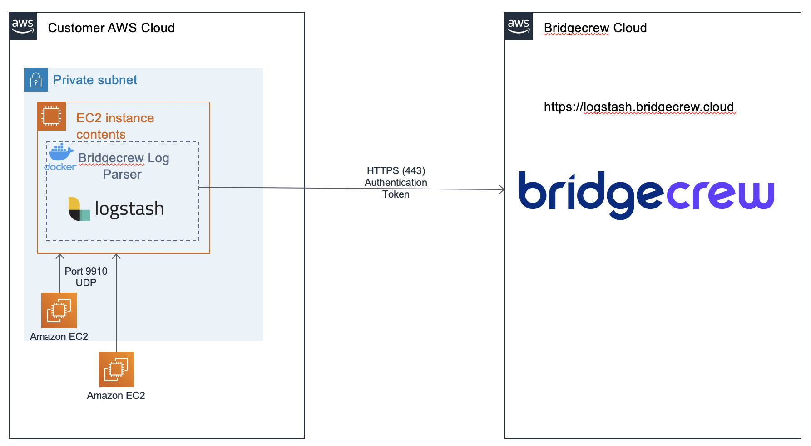

# OpenVPN Log Integration
[](https://hub.docker.com/r/bridgecrew/openvpn-logs-integration)

This docker contains a Logstash agent that enables secure transport of log data back to Bridgecrew Console. It is set to collect data from an OpenVPN AS server log (using syslog) and send it to Bridgecrew via HTTPS.

## OpenVPN auth

## Architecture


### 1. Update rsyslog configuration

```
cat << EOF > /etc/rsyslog.d/01-openvpn-log.conf
module(load="imfile")

input(type="imfile"
      File="/var/log/openvpn.log"
      Tag="openvpn"
)

if $programname == 'openvpn' then {
    action(
        type="omfwd"
        Target="bridgecrew-openvpn-integration.bridgecrew.local"
        Port="9910"
        Protocol="udp"
    )
    stop
}
EOF
systemctl restart rsyslog
systemctl status -l rsyslog
```

### 2. Install the openvpn integration docker
###### Port verification
Port 9910 (UDP) must be open between the to the logstash host (listening port).
Verify that `iptables` is configured to allow incoming traffic on port 9910.

#### Installation

1. ssh into the server where logstash-docker should be deployed
2. Install docker
3. Verify docker install by running the following command: ``` docker info ```
4. Run syslog-integration docker by executing:
```sh
docker run -d -p 9910:9910/udp -e BC_CUSTOMER_NAME=[REPLACE_WITH_CUSTOMER_NAME] -e BC_API_TOKEN=[REPLACE_WITH_API_TOKEN] -e BC_URL="https://logstash.bridgecrew.cloud/logstash" bridgecrew/openvpn-integration
```

Alternatively, look in the examples folder for this integration to see a Fargate-based deployment

### Troubleshooting

Make certain you can connect from the openvpn server to the host/port in question.  

```
nslookup bridgecrew-openvpn-integration.bridgecrew.local
yum -y install nv 
nc -z -v -u bridgecrew-openvpn-integration.bridgecrew.local 9910
```
IMPORTANT: For private zone resolution you must have DNS hostnames enabled for your VPC.  In my experience, EC2 instances needed to be rebooted to see this flag after being set.  For reference: 
https://aws.amazon.com/premiumsupport/knowledge-center/vpc-enable-private-hosted-zone/

