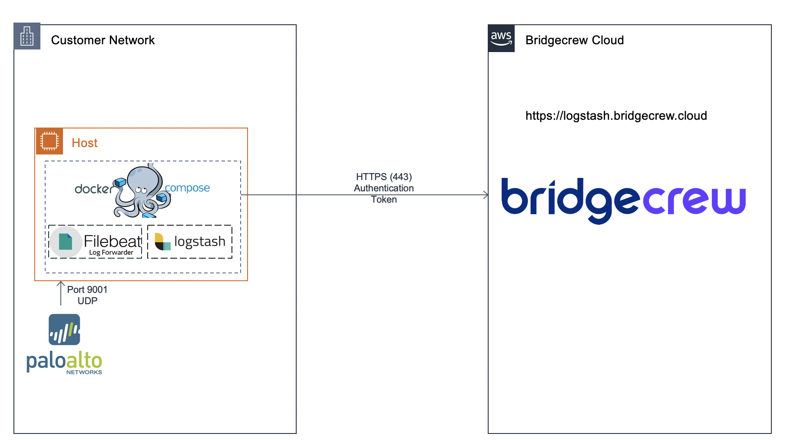

# PAN-OS Integration
[](https://hub.docker.com/r/bridgecrew/pan-os-integration)

## Architecture 


## Integration Steps
The installation includes 2 steps:
1. Deploy PAN-OS integration with docker-compose
2. Configure syslog monitoring on your PAN-OS and forward it to the instance

### Deploying the Integration Docker
1. SSH to a server where the docker-compose should be deployed
2. Copy the docker-compose yaml to the local machine and replace the two parameters with the ones supplied to you.
    ```sh 
    version: '3.7'
    services:
      filebeat:
        image: bridgecrew/pan-os-integration
        user: root
        volumes:
          - /var/run/docker.sock:/var/run/docker.sock:ro
          - /var/lib/docker/containers:/var/lib/docker/containers:ro
      logstash:
        image: bridgecrew/logstash-integration
        environment:
          INTEGRATION_TYPE: pan-os
          BC_CUSTOMER_NAME: ${BC_CUSTOMER_NAME}
          BC_API_TOKEN: ${BC_API_TOKEN}
          BC_URL: https://logstash.bridgecrew.cloud
    ```
3. Run the docker-compose with the following command:
    ```bash
    docker-compose up 
    ```
4. Verify dockers are running by running the following command: 
    ```bash
    docker info
   ```

### Enable auditing of PAN-OS
Please follow the official [Palo Alto Networks guide](https://docs.paloaltonetworks.com/pan-os/7-1/pan-os-admin/monitoring/use-syslog-for-monitoring/configure-syslog-monitoring).
The relevant configurations:

- `Syslog Server` - IP address of the docker's host
- `Transport` - UDP
- `Port` - 9001 