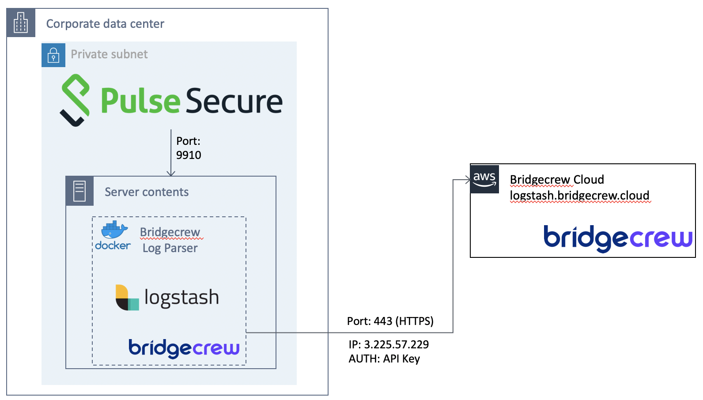

# Docker-Pulse Secure VPN-Integration
[](https://hub.docker.com/r/bridgecrew/fortigate-integration)

The docker contains a running Logstash agent. The docker is collecting data from [Pulse Secure Virtual Traffic Manager](https://www.pulsesecure.net/) (using syslog) and sends the log data to Bridgecrew cloud in an encrypted secured manner.

## Architecture 


## Pulse Secure
The installation includes 2 steps:   
 1) Configuring the Traffic Manager to Export Data to Logstash
 2) Installing the Pulse Secure integration docker 
 
 
 ### 1. Pulse Secure Traffic Manager syslog configuration
 Follow PulseSecure export guide as described here [here](https://docs.pulsesecure.net/WebHelp/PvTM/18.3/ps-vtm-18.3-userguide/ps-vtm-18.3-userguide/KeyFeatures/KeyFeatures.htm#XREF_24697_Exporting).
    
#### Configure transaction metadata configuration on PulseSecure
| Key | Description| 
|-----|------------|
| transaction_export!endpoint | IP_SERVER_DOCKER:PORT (For example -localhost:9910)|
| transaction_export!tls | No |
| transaction_export!enabled | Yes |   

#### Log files configuration on PulseSecure
| Key | Description| 
|-----|------------|
| log_export!endpoint | IP_SERVER_DOCKER:PORT (For example -localhost:9910)|
| log_export!enabled | Yes |


### 2. Install the syslog integration docker 
###### Port verification
The port `9910` (TCP) must be open to the Pulse Secure host (listening port).   
Verify that `iptables` is configured to allow incoming traffic on port `9910`.

#### Installation

1. SSH to a server where the pulse-docker should be deployed
2. Install docker
3. Verify docker by running the following command: ``` docker info ```
4. Run pulse-integration docker by executing:
```sh
docker run -d -p 9910:9910 -e BC_CUSTOMER_NAME=[REPLACE_WITH_CUSTOMER_NAME] -e BC_API_TOKEN=[REPLACE_WITH_API_TOKEN] -e BC_URL="https://logstash.bridgecrew.cloud/logstash" bridgecrew/pulse-integration
```
#### Network settings:
logstash.bridgecrew.cloud IP address is: `3.225.57.229`
To forward data to that address make sure you enable `HTTPS` (port `443`) communication from the docker host to the logstash server.
