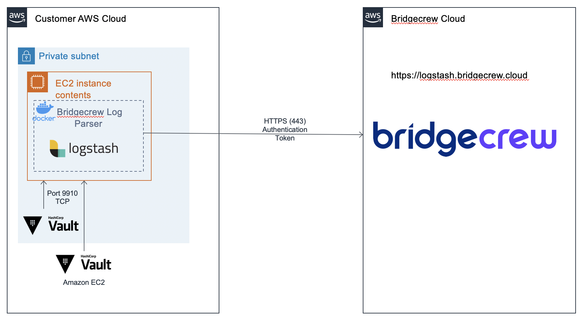

# Hashicorp Vault Integration
[](https://hub.docker.com/r/bridgecrew/vault-integration)

## Architecture 


## Integration Steps
The installation includes 2 steps:   
1. Deploy vault integration docker
2. Enable tcp auditing on vault server

### 1. Deploy Integration Docker

1. SSH to a server where the pulse-docker should be deployed
2. Install docker
```sh 
docker pull bridgecrew/vault-integration:latest 
```

3. Verify docker by running the following command: ``` docker info ```
4. Run pulse-integration docker by executing:
```sh
docker run -d -p 9910:9910 -e BC_CUSTOMER_NAME=[REPLACE_WITH_CUSTOMER_NAME] -e BC_API_TOKEN=[REPLACE_WITH_API_TOKEN] -e BC_URL="https://logstash.bridgecrew.cloud/logstash" bridgecrew/vault-integration
```

### 2. Configure Vault Audit
To enable auditing replace the string `[REPLACE_WITH_DOCKER_HOST_ADDRESS]` and execute the following command:
```bash
./vault audit enable socket
vault audit enable socket address=[REPLACE_WITH_DOCKER_HOST_ADDRESS]:9910 socket_type=tcp format=jso
```

Full vault configuration guide can be found [here](https://www.vaultproject.io/docs/audit/socket.html).
